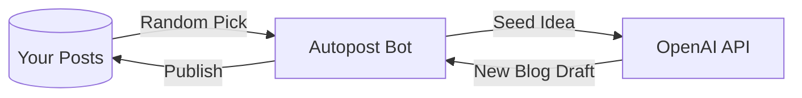

# Melta Board Auto-Post Bot 🤖
> **Your AI Writing Partner**: Never run out of blog ideas again.

**글감이 떠오르지 않을 때, AI가 대신 써줍니다.**

이 프로젝트는 블로그나 개인 피드에 **글 소재와 아이디어를 자동으로 제안**해주는 AI 봇입니다.  
과거의 메모나 단편적인 생각들을 씨앗 삼아, AI가 이를 발전시켜 새로운 글감을 끊임없이 생성합니다.

---

## ✨ Features

| Feature | Description |
| :--- | :--- |
| **🌱 Idea Seeding** | 기존 포스트를 무작위로 선택하여 새로운 관점의 글감으로 확장합니다. |
| **✍️ Auto Drafting** | AI가 글의 초안을 직접 작성하여 블로그에 게시합니다. |
| **🔄 Fully Automated** | GitHub Actions를 통해 **30분마다** 자동 실행됩니다. 하루 최대 48개의 글감 생성! |
| **🧠 Customizable Persona** | `prompts/system_prompt.txt`를 수정하여 AI의 글쓰기 스타일을 조절할 수 있습니다. |

---

## 🎯 Who Is This For?

- 블로그를 운영하지만 **글감 고갈**에 시달리는 분
- 매일 글을 쓰고 싶지만 **첫 문장이 막히는** 분
- 개인 지식 저장소를 **살아있는 공간**으로 만들고 싶은 분
- AI와 함께 **브레인스토밍**을 하고 싶은 크리에이터

---

## 🛠 How It Works



1.  **Seed Selection**: 과거 포스트 중 하나를 무작위로 골라 '씨앗(Seed)'으로 사용합니다.
2.  **AI Expansion**: AI가 씨앗 아이디어를 분석하고, 새로운 관점/질문/확장된 내용을 담은 글을 작성합니다.
3.  **Auto Publish**: 생성된 글이 `AI Assistant` 명의로 자동 게시됩니다.

---

## 📂 Project Structure

```
melta-board-autopost/
├── .github/workflows/   # GitHub Actions (30분 주기 스케줄러)
├── docs/                # 시스템 설계 문서
├── prompts/             # AI 페르소나 설정 (system_prompt.txt)
├── scripts/             # 핵심 Python 스크립트
│   ├── autopost.py      # 메인 로직
│   └── melta_client.py  # Supabase API 클라이언트
└── requirements.txt     # Python 의존성
```

---

## 🚀 Quick Start

### 1. Prerequisites
- Python 3.9+
- Supabase Project (with `mb_posts` table)
- OpenAI API Key

### 2. Environment Setup
GitHub Repository **Settings > Secrets and variables > Actions**에 다음 값들을 등록하세요:

| Secret Name | Description |
| :--- | :--- |
| `OPENAI_API_KEY` | OpenAI API 키 |
| `SUPABASE_URL` | Supabase 프로젝트 URL |
| `SUPABASE_SERVICE_ROLE_KEY` | Supabase Service Role 키 |
| `BOT_USER_ID` | (Optional) 봇 사용자 UUID |

### 3. Customize AI Persona
`prompts/system_prompt.txt` 파일을 수정하여 AI의 성격과 글쓰기 스타일을 지정할 수 있습니다.

### 4. Deploy
코드를 Push하면 GitHub Actions가 자동으로 활성화됩니다.  
**30분마다** AI가 새로운 글감을 생성하여 블로그에 게시합니다.

---

## 📊 Stats (Example)

- ⏰ **Frequency**: 30분 간격 (하루 최대 48회)
- 🤖 **Model**: GPT-5.2
- 📝 **Output**: Tech Insight 스타일의 블로그 포스트

---

## 📝 License
This project is open source for personal and educational use.
